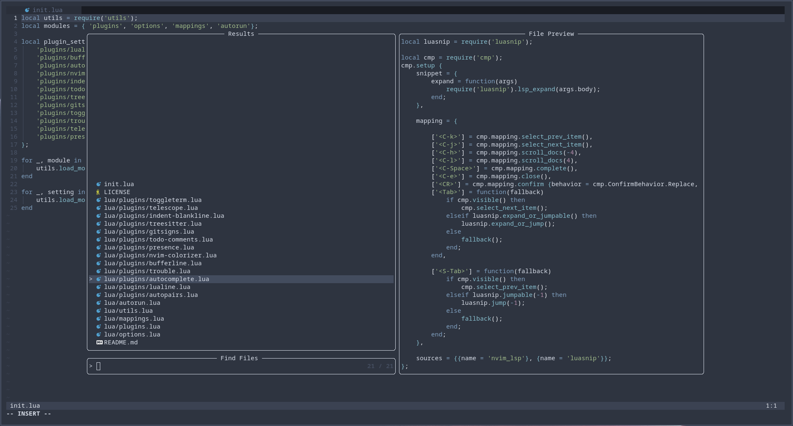

## Features

These Neovim dotfiles contain the following features:
- autocomplete (Ctrl + P)
- quick-switcher/file finder (Ctrl + K)
- internal terminal (Ctrl + T)
- bufferline with tab management
- status line with useful information
- todo comment highlights
- discord presence/status integration
- The Super Sexy Nord Theme

## Information

- you must to be running Neovim on v0.5.0 or later
- the plugin manager being used is [packer.nvim](https://github.com/wbthomason/packer.nvim)

## Screenshot

